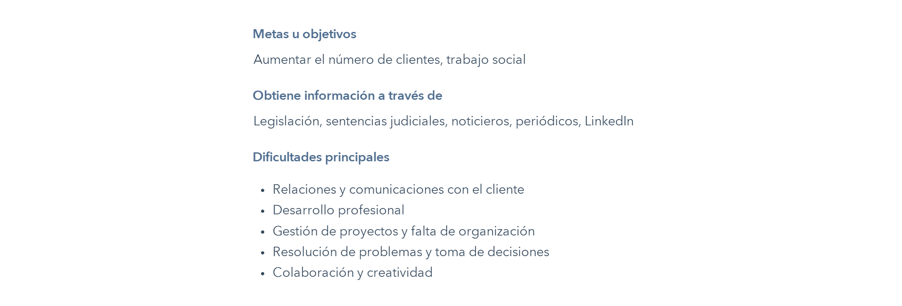
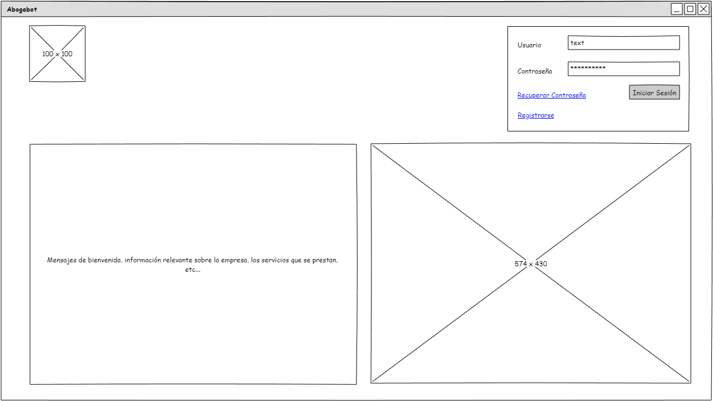
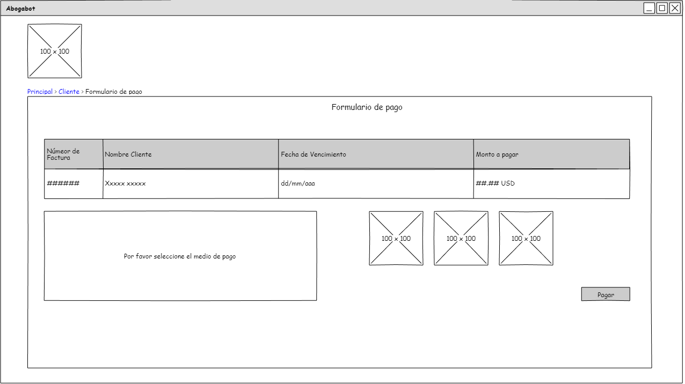

# ABOGABOT

## Tabla de Contenido

 1. [Requerimientos](#1-requerimientos)
    - [Requisitos generales](#requisitos-generales)
    - [Requisitos para el Usuario - Cliente del Despacho](#requisitos-para-el-usuario---cliente-del-despacho)
    - [Requisitos para el Usurio - Administrador](#requisitos-para-el-usurio---administrador)
    - [Diagrama de flujo](#diagrama-de-flujo)
  2. [Buyer Persona](#2-buyer-persona)
  3. [Público Objetivo](#3-público-objetivo)
  4. [Wireframe](#3-wireframe)
#

## 1. Requerimientos

El cliente, un despacho de abogados, requiere automatizar las demandas que presentan sus clientes, a partir de una página web que captura un formulario.

### Requisitos generales

- Pagina de bienvenida
- Formulario de inicio de sesión
- Página Responsive
- Colores corporativos azul marino y blanco

### Requisitos para el Usuario - Cliente del Despacho

- Formulario de registro
- Formulario de diligenciamiento de demanda
- Formulario de pago
- Vista con información del usuario y estado
- Notificaciones al correo sobre avande del proceso

### Requisitos para el Usurio - Administrador

- Notificación nueva demanda
- Exportar un documento Word con una plantilla que involucre los datos del formulario
- Vista con pagos, con dashboard de ingresos
- Actualizar procesos de la demanda y agregar comentarios.

### Diagrama de flujo

Diagrama de flujo de los requerimientos

## 2. Buyer Persona

## 3. Público Objetivo

## 4. Wireframe

### Página de Bienvenida

### Formulario de Registro

### Recuperar contraseña

### Página Principal Cliente

### Formulario Demanda

### Formulario Pago

## Formulario Pago Exitoso

